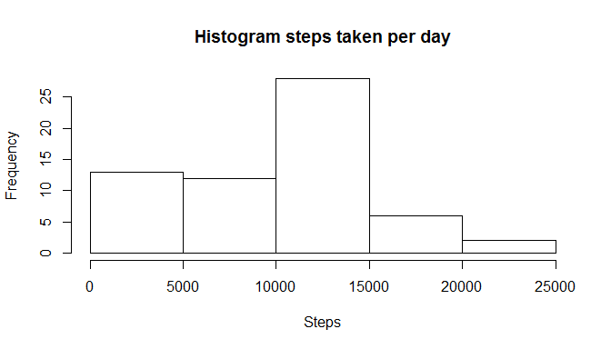
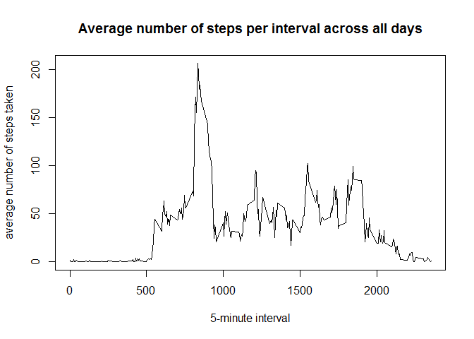
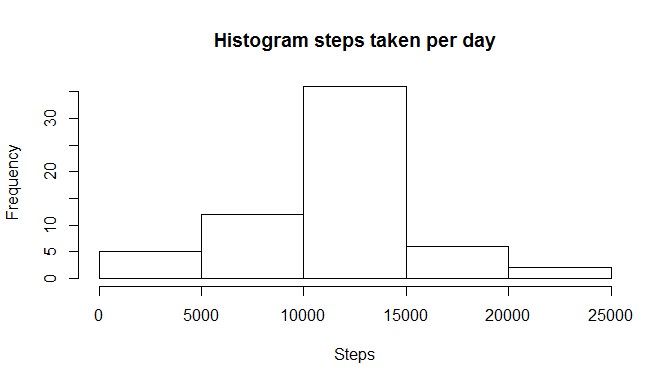
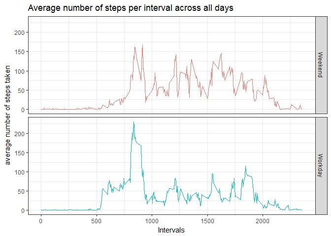

# Reproducible Research: Peer Assessment 1
Herson Melo  


```r
library(dplyr)
library(tidyr)
library(ggplot2)
library(lubridate)
```


## Loading and preprocessing the data


```r
###
# Show any code that is needed to
# 
# 1. Load the data (i.e. read.csv())
# 2. Process/transform the data (if necessary) into a format suitable for your analysis
###

if(!exists("activity")) {
    filenameCSV <- "activity.csv"
    filenameZIP <- "activity.zip"
    
    if(!file.exists(filenameCSV)) {
        if(file.exists(filenameZIP)) {
            unzip(filenameZIP)
        }
    }
    if(!file.exists(filenameCSV)) {
        stop("FATAL ERROR: Dataset was not found!")
    }
    
    activity <- read.csv(filenameCSV)
}

activity$date <- as.Date(as.character(activity$date), "%Y-%m-%d")
```


## What is mean total number of steps taken per day?


```r
###
# For this part of the assignment, you can ignore the missing values in the 
# dataset.
# 
# 1. Calculate the total number of steps taken per day
# 2. If you do not understand the difference between a histogram and a barplot, 
#     research the difference between them. Make a histogram of the total number
#     of steps taken each day
# 3. Calculate and report the mean and median of the total number of steps taken
#     per day
###
```

1. Calculate the total number of steps taken per day


```r
steps.per.day <- activity %>% 
    group_by(date) %>% 
    summarise(tot.steps = sum(steps, na.rm = TRUE))
```

2. Make a histogram of the total number of steps taken each day


```r
hist(steps.per.day$tot.steps, 
     main = "Histogram steps taken per day", 
     xlab = "Steps")
```

<!-- -->

3. Calculate and report the mean and median total number of steps taken per day


```r
#summary(t)
res <- steps.per.day %>% 
    summarise(mean = mean(tot.steps, na.rm = T), 
              median = median(tot.steps, na.rm = T))
print(res)
```

```
## # A tibble: 1 × 2
##      mean median
##     <dbl>  <int>
## 1 9354.23  10395
```

## What is the average daily activity pattern?


```r
###
# 1. Make a time series plot (i.e. type = "l") of the 5-minute interval (x-axis)
#    and the average number of steps taken, averaged across all days (y-axis)
# 2. Which 5-minute interval, on average across all the days in the dataset, 
#    contains the maximum number of steps?
###
```

1. Time series for the average number of steps per interval across all days


```r
intervals.means <- na.omit(activity) %>%
    group_by(interval) %>%
    summarise(mean = mean(steps))

plot(intervals.means$interval, intervals.means$mean, type = "l", 
     main = "Average number of steps per interval across all days",
     xlab = "5-minute interval",
     ylab = "average number of steps taken")
```

<!-- -->

2. Which 5-minute interval, on average across all the days in the dataset, 
contains the maximum number of steps?


```r
intervals.means[which.max(intervals.means$mean), ]$interval
```

```
## [1] 835
```


## Imputing missing values


```r
###
# Note that there are a number of days/intervals where there are missing values 
# (coded as NA). The presence of missing days may introduce bias into some 
# calculations or summaries of the data.
# 
# 1. Calculate and report the total number of missing values in the dataset 
#    (i.e. the total number of rows with NAs)
# 2. Devise a strategy for filling in all of the missing values in the dataset. 
#    The strategy does not need to be sophisticated. For example, you could use
#    the mean/median for that day, or the mean for that 5-minute interval, etc.
# 3. Create a new dataset that is equal to the original dataset but with the 
#    missing data filled in.
# 4. Make a histogram of the total number of steps taken each day and Calculate
#    and report the mean and median total number of steps taken per day. Do 
#    these values differ from the estimates from the first part of the 
#    assignment? What is the impact of imputing missing data on the estimates
#    of the total daily number of steps?
###
```

1. Calculate and report the total number of missing values in the dataset


```r
#na.status <- table(complete.cases(activity$steps))

total.nas <- sum(is.na(activity$steps))
print(total.nas)
```

```
## [1] 2304
```

2+3. Filling in all of the missing values with the mean of the 5-minute interval


```r
activity2 <- activity %>%
    left_join(intervals.means, by = "interval") %>%
    mutate(steps = ifelse(!is.na(steps), steps, mean)) %>%
    select(-mean)
```

4.a. Make a histogram of the total number of steps taken each day


```r
steps.per.day.2 <- activity2 %>% 
    group_by(date) %>% 
    summarise(tot.steps = sum(steps))

hist(steps.per.day.2$tot.steps, 
     main = "Histogram steps taken per day", 
     xlab = "Steps")
```

<!-- -->

4.b. Calculate and report the mean and median total number of steps taken per day


```r
res <- steps.per.day.2 %>% 
    summarise(mean = mean(tot.steps), 
              median = median(tot.steps))
print(res)
```

```
## # A tibble: 1 × 2
##       mean   median
##      <dbl>    <dbl>
## 1 10766.19 10766.19
```

## Are there differences in activity patterns between weekdays and weekends?


```r
###
# For this part the weekdays() function may be of some help here. Use the dataset
# with the filled-in missing values for this part.
# 
# 1. Create a new factor variable in the dataset with two levels – “weekday” and
#     “weekend” indicating whether a given date is a weekday or weekend day.
# 2. Make a panel plot containing a time series plot (i.e. type = "l") of the
#     5-minute interval (x-axis) and the average number of steps taken, averaged
#     across all weekday days or weekend days (y-axis). See the README file in 
#     the GitHub repository to see an example of what this plot should look like
#     using simulated data.
###
```

1. Create a new factor variable


```r
#activity2$wday <- lubridate::wday(activity2$date)
activity2$workday <- factor(ifelse(lubridate::wday(activity2$date) %in% c(1,7), "Weekend", "Workday"), levels = c("Weekend", "Workday"))
```

2. Make a panel plot containing a time series plot


```r
intervals.means.2 <- activity2 %>%
    group_by(workday, interval) %>%
    summarise(mean = mean(steps)) %>%
    ungroup()

ggplot(intervals.means.2, aes(x = interval, y = mean, color = workday)) + 
    geom_line(show.legend = F) + 
    facet_grid(workday~.) +
    labs(
        title = "Average number of steps per interval across all days",
        y = "average number of steps taken",
        x = "Intervals"
    ) + 
    theme_bw()
```

<!-- -->


